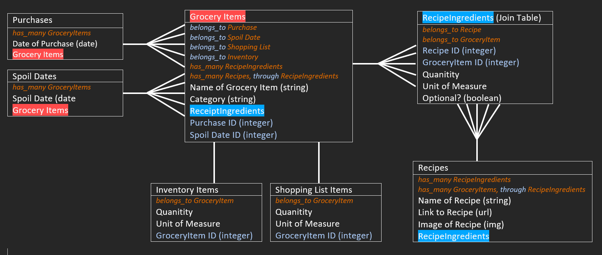

# React App - Unspoiled

This project was bootstrapped with [Create React App](https://github.com/facebook/create-react-app).

## Project Pitch:
The aim of our web application is to alleviate the struggle of using groceries <em>before</em> they spoil. Our application will allow a user to submit a list of items purchased at the grocery store and create an inventory of all grocery items owned. The user can view all items available and remove items as they are used. The user can add items to a shopping list as needed. The user can sort by different criteria, including a sort by spoil-by date to ensure the items are used <em>before</em> they spoil. The user can add recipes to a collection and see all recipes in the collection along with which ingredients they have for those recipes. 

### Framework/Mockup (backend):

### Framework/Mockup (frontend):
<em>TBD</em>

## User Stories:
As a user, I should be able to:
-	Enter new transactions into a form
-   Have newly purchased grocery items (from transactions) added to the inventory
-	See a list of all grocery items in the inventory
-	Sort the inventory bys 'spoil-by’ date
-	Filter the invetory by different critera (category, recipe, use by date, etc.)
-	Be able to search through my inventory for specific items
-	Remove items from my inventory as I use those items

-	Add items to my Shopping List when I need to restock
-	See my entire Shopping List
-	Remove things from my Shopping List

-	See all recipes I can make for each item in my inventory
-	See all items I need for a recipe (including optional items)
-	Add new recipes to my collection of recipes
-	See my collection of recipes
-	Sort my collection of recipes by items that will expire the soonest
-	Show what items are missing from my inventory for each recipee
-	See a notification for all foods that are about to spoil
-	See a notification for all foods that have spoiled and need to be removed from inventory

## Project Requirements:
For this project, you must:

    ☑ Use Active Record to interact with a database.
    ☑ Have a minimum of two models with a one-to-many relationship.
        - Shopping List (one to many) Grocery Items
        - Transaction (one to many) Grocery Items
        - Grocery Items (many to many) Recipe Ingredients
            - Grocery Items (many to many) Recipes (through Recipe Ingredients)
        - Recipes (many to many) Recipe Ingredients
            - Recipes (many to many) Grocery Items (through Recipe Ingredients)
     ☑ Create API routes in Sinatra that handles at least three different CRUD actions for at least one of your Active Record models.
        - Create new Grocery Items
        - Create new Transactions
        - Create new Recipes
        - Read all Grocery Items (i.e. the 'inventory')
        - Read all Recipes
        - Update Grocery Items (quantity, as used)
        - Update Shopping List (add or remove items)
        - Delete Grocery Items (i.e. as items are used up)
- Build a separate React frontend application that interacts with the API to perform CRUD actions.
- Use good OO design patterns. You should have separate classes for each of your models, and create instance - and class methods as necessary.
